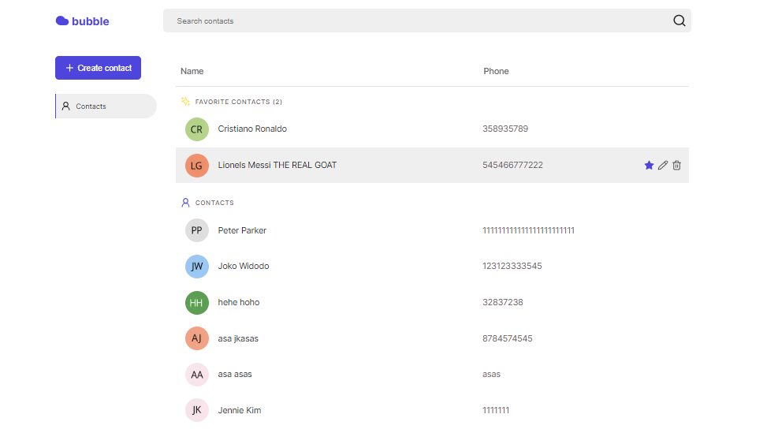

<h1 align="center">
    <a href="https://bubble-one.vercel.app">Bubble</a>
</h1>

  <a href="#introduction"><strong>Introduction</strong></a> ·
  <a href="#tech-stack"><strong>Tech Stack</strong></a> ·
  <a href="#features"><strong>Features</strong></a> ·

 

    

## Introduction

Bubble is a contact list management app. Built with [Nextjs](https://nextjs.org/), [Typescript](https://www.typescriptlang.org/), and [Emotion css](https://emotion.sh/docs/introduction).

## Tech Stack

- [Nextjs](https://nextjs.org/) – framework
- [Typescript](https://www.typescriptlang.org/) – language
- [Emotion css](https://emotion.sh/docs/introduction) – styling
- [Apollo Client](https://www.apollographql.com/docs/react/) – state management, GraphQL

## Features

Here are some of the features:

- [Contact List & Search](#contact-list-&-search)
- [Favorites](#favorites)
- [Manage Contact](#manage-contact)

### Contact List & Search

See your contacts info.

### Favorites

Choose your favorite contacts.

### Manage Contact

Add & Edit contact information.

